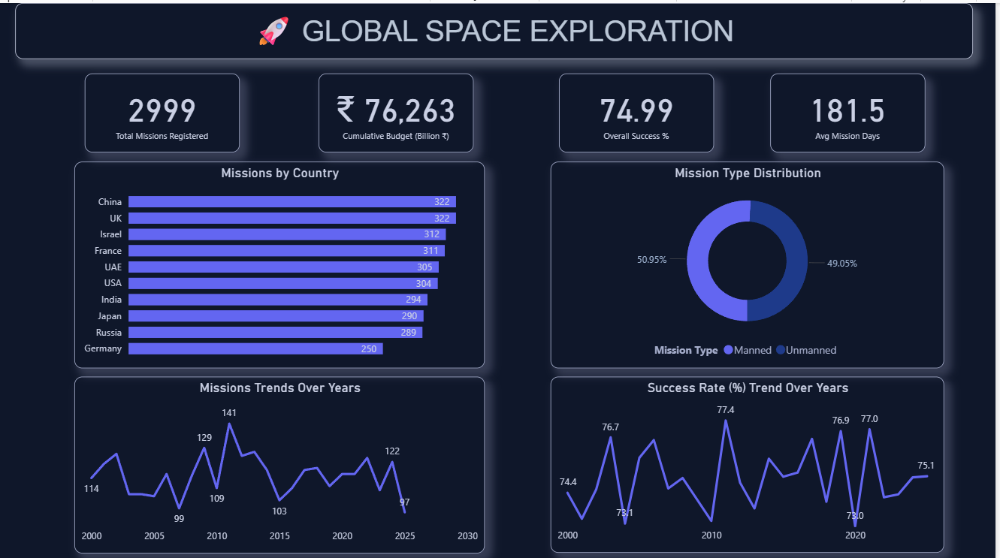
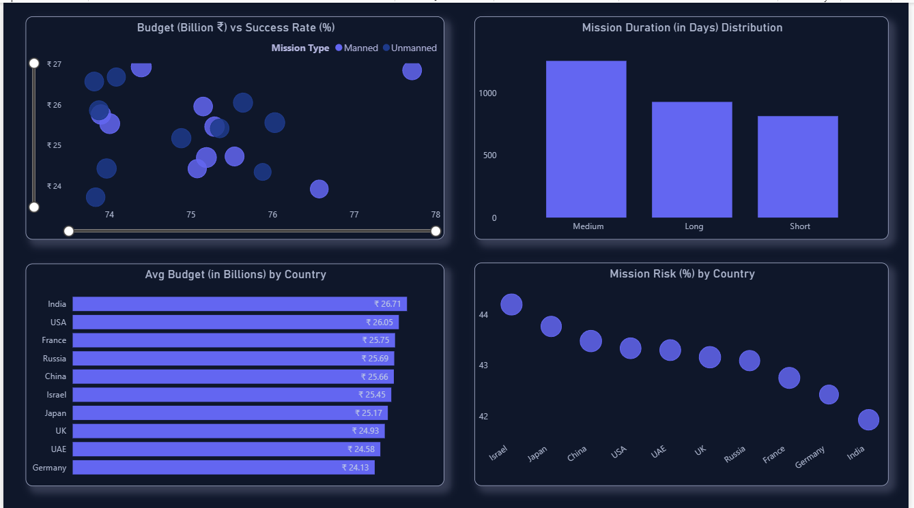
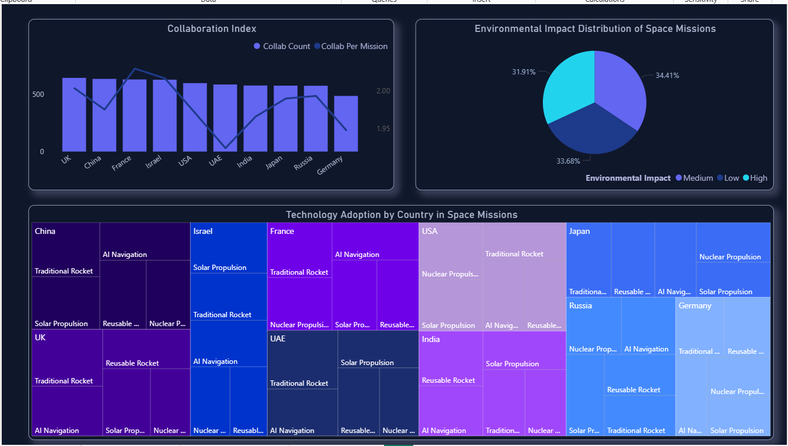

# 🚀 Global Space Exploration Dashboard (Power BI)

## 📌 Overview
An interactive Power BI dashboard analyzing global space missions across countries, budgets, risks, technologies, and success rates.

## 📊 Key KPIs
- Total Missions: 2999
- Cumulative Budget: ₹76.26 Billion
- Overall Success Rate: 74.99%
- Avg Mission Duration: 181.5 days

## 📈 Insights
- China & UK lead in total missions
- AI Navigation and Reusable Rockets dominate adoption
- Higher budget correlates with higher success rate
- Medium-duration missions are most common

## 🛠 Tools & Technologies
- Power BI
- DAX
- Data Modeling

## 📂 Project Structure
- `Power BI report/` (.pbix)
- `screenshots/` → Dashboard visuals
- `Dataset/` → Measures

## 🧠 Use Case
- Space research analysis
- Government & policy insights
- Academic & portfolio project

## 📸 Dashboard Preview

